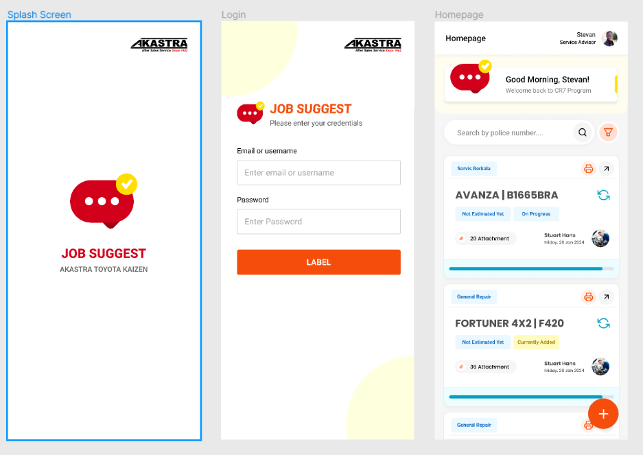

# Job Suggest CR7
a progressive web application for car owners to receive personalized service suggestions for their vehicles based on technician recommendations. The app aims to enhance customer experience, increase car safety awareness, and improve retention rates for the car shop.





### 📊 Database Scheme 


> public/docs/database-scheme.pdf


### ⚒️ Prerequisite

 - [Composer](https://getcomposer.org/)
 - [MySQL Database](https://www.mysql.com/)

### 🚀 Getting Started!

Clone this project

```bash
  git clone https://github.com/faidfadjri/job-suggest.git
```

> Run your MySQL Services ( XAMPP, LAMPP, etc )

Setup project by running this command

```bash
  make setup
```

### Authors

- [@Faid Fadjri](https://faidfadjri.github.io/)


### 🔗 Links
[](https://faidfadjri.github.io/)
[](https://www.linkedin.com/in/faidfadjri)


That's it, You're ready to fire! 🔥
